## Домашнє завдання до Теми 4. DML та DDL команди. Складні SQL вирази

### Виконання.

#### 1. Створіть базу даних для керування бібліотекою книг згідно зі структурою
Використовуйте DDL-команди для створення необхідних таблиць та їх зв'язків.

##### Структура БД
a) Назва схеми — “LibraryManagement”

```sql
create schema LibraryManagement;
use LibraryManagement;
```

b) Таблиця "authors":
 - author_id (INT, автоматично зростаючий PRIMARY KEY)
 - author_name (VARCHAR)

```sql
create table authors (
 author_id int auto_increment primary key,
 author_name varchar(64)
);
```

c) Таблиця "genres":
 - genre_id (INT, автоматично зростаючий PRIMARY KEY)
 - genre_name (VARCHAR)

```sql
create table genres (
 genre_id int auto_increment primary key,
 genre_name varchar(64)
);
```

d) Таблиця "books":
 - book_id (INT, автоматично зростаючий PRIMARY KEY)
 - title (VARCHAR)
 - publication_year (YEAR)
 - author_id (INT, FOREIGN KEY зв'язок з "Authors")
 - genre_id (INT, FOREIGN KEY зв'язок з "Genres")

```sql
create table books (
 book_id int auto_increment primary key,
 title varchar(256),
 publication_year year,
 author_id int,
 genre_id int,
 foreign key (author_id) references authors(author_id),
 foreign key (genre_id) references genres(genre_id)
);
```

e) Таблиця "users":
 - user_id (INT, автоматично зростаючий PRIMARY KEY)
 - username (VARCHAR)
 - email (VARCHAR)

```sql
create table users (
 user_id int auto_increment primary key,
 username varchar(64),
 email varchar(64)
);
```

f) Таблиця "borrowed_books":
 - borrow_id (INT, автоматично зростаючий PRIMARY KEY)
 - book_id (INT, FOREIGN KEY зв'язок з "Books")
 - user_id (INT, FOREIGN KEY зв'язок з "Users")
 - borrow_date (DATE)
 - return_date (DATE)

```sql
create table borrowed_books (
 borrow_id int auto_increment primary key,
 book_id int,
 user_id int,
 borrow_date date,
 return_date date,
 foreign key (book_id) references books(book_id),
 foreign key (user_id) references users(user_id)
);
```
##### Згенеровані таблиці
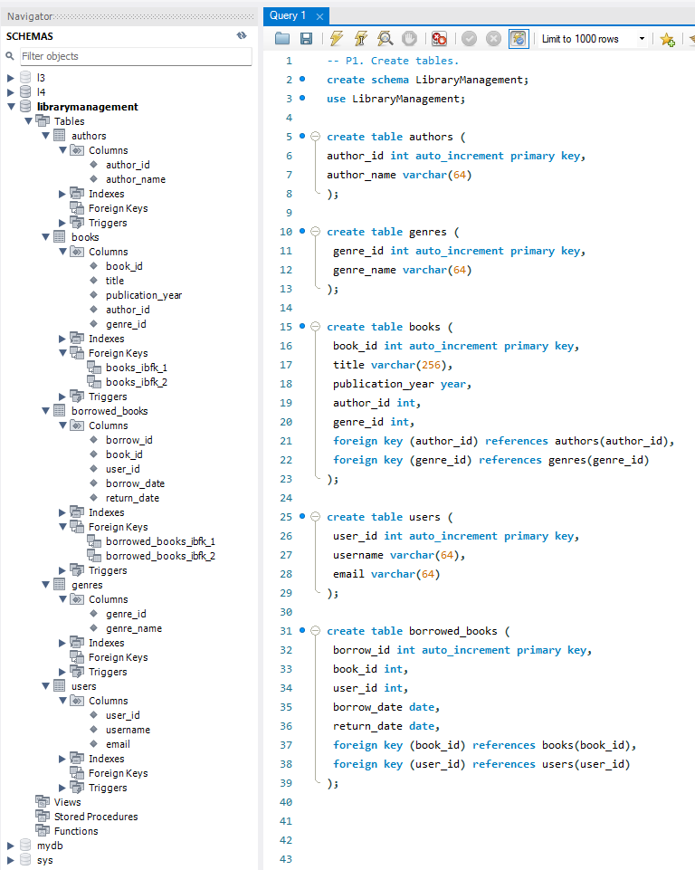

#### 2. Заповніть таблиці простими видуманими тестовими даними.
Достатньо одного-двох рядків у кожну таблицю.

**Автори**
```sql
insert into authors (author_name) values ("Макс Кідрук");
insert into authors (author_name) values ("Ілларіон Павлюк");
insert into authors (author_name) values ("Світлана Тараторіна");
select * from authors;
```
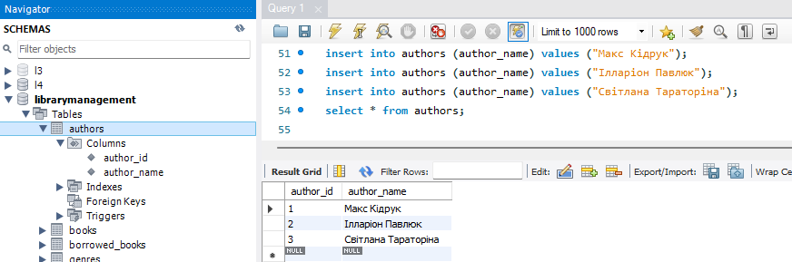

**Жанри**
```sql
insert into genres (genre_name) values ("фантастика");
insert into genres (genre_name) values ("детектив");
insert into genres (genre_name) values ("трилер");
insert into genres (genre_name) values ("містика");
insert into genres (genre_name) values ("проза");
select * from genres;
```
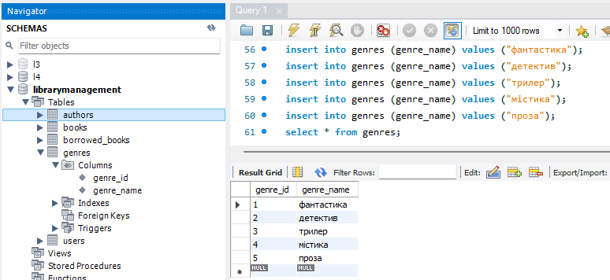

**Книги**
```sql
insert into books (title, publication_year, author_id, genre_id)
values ("Бот", 2012, 1, 1);
insert into books (title, publication_year, author_id, genre_id)
values ("Жорстоке небо", 2014, 1, 1);
insert into books (title, publication_year, author_id, genre_id)
values ("На Зеландію!", 2014, 1, 5);
insert into books (title, publication_year, author_id, genre_id)
values ("Білий попіл", 2019, 2, 2);
insert into books (title, publication_year, author_id, genre_id)
values ("Я бачу, вас цікавить пітьма", 2020, 2, 3);
insert into books (title, publication_year, author_id, genre_id)
values ("Лазарус", 2018, 3, 4);
select * from books;
```
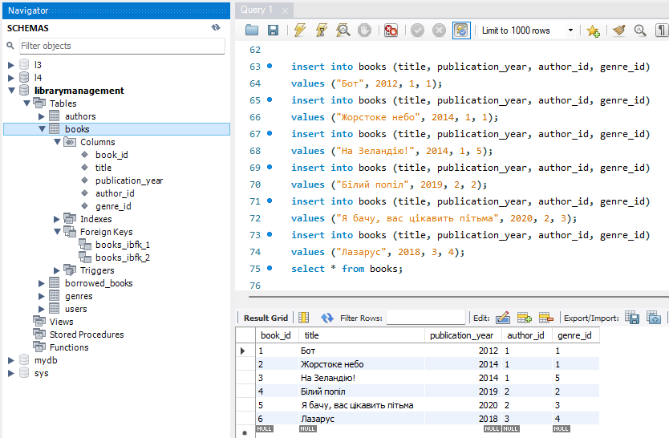

**Користувачі**
```sql
insert into users (username, email)
values ("Андрій Соломаха", "solomakha91@ukr.net");
insert into users (username, email)
values ("Тетяна Гарна", "harna_t@i.ua");
insert into users (username, email)
values ("Сергій Коваленко", "koval777@ukr.net");
insert into users (username, email)
values ("Степан Підопригора", "goodname143@ukr.net");
insert into users (username, email)
values ("Остап Плугар", "ostapp88@ukr.net");
insert into users (username, email)
values ("Наталя Залужна", "kvitka_333@meta.net");
select * from users;
```
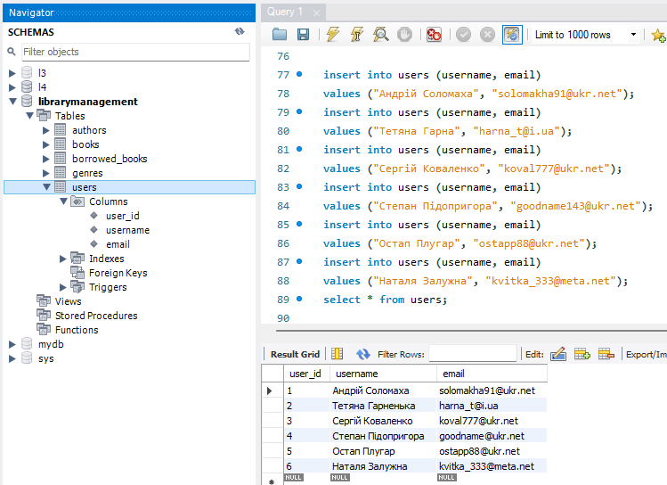

**Видані книги**
```sql
insert into borrowed_books (book_id, user_id, borrow_date, return_date)
values (4, 1, '2020-02-23', '2020-05-02');
insert into borrowed_books (book_id, user_id, borrow_date)
values (1, 1, '2021-10-30');
insert into borrowed_books (book_id, user_id, borrow_date, return_date)
values (3, 6, '2021-01-31', '2021-10-20');
insert into borrowed_books (book_id, user_id, borrow_date, return_date)
values (4, 3, '2023-09-02', '2023-12-02');
select * from borrowed_books;
```
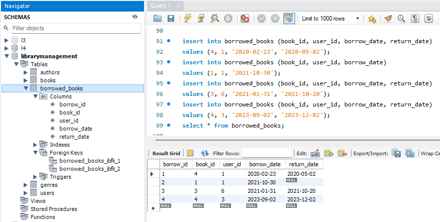

#### 3. Перейдіть до бази даних, з якою працювали у темі 3. Напишіть запит за допомогою операторів FROM та INNER JOIN.
Запит має об’єднувати всі таблиці даних, які ми завантажили з файлів: order_details, orders, customers, products, categories, employees, shippers, suppliers. Для цього ви маєте знайти спільні ключі.

Перевірте правильність виконання запиту.

```sql
use l3;

select * from orders
inner join order_details on orders.id = order_details.order_id
inner join products on order_details.product_id = products.id
inner join customers on orders.customer_id = customers.id
inner join categories on products.category_id = categories.id
inner join suppliers on products.supplier_id = suppliers.id
inner join employees on orders.employee_id = employees.employee_id
inner join shippers on orders.shipper_id = shippers.id
;
```
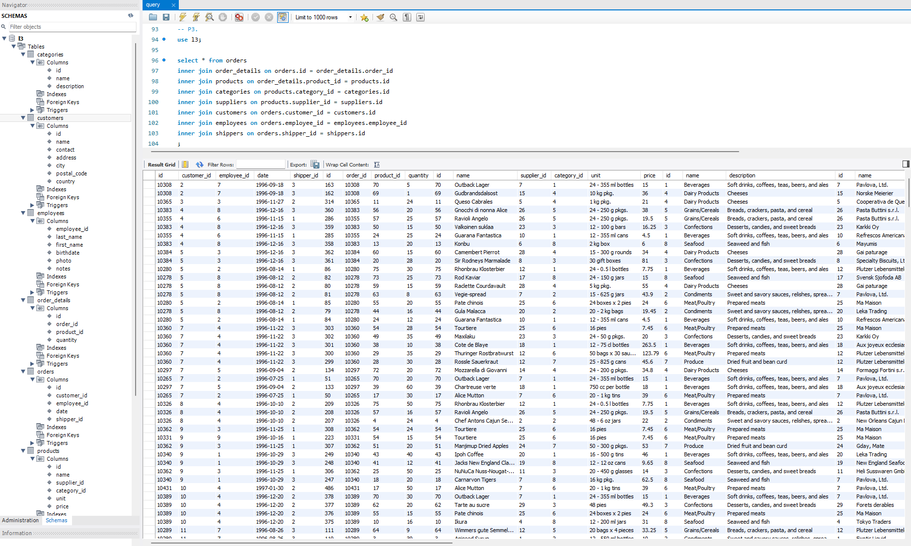

#### 4. Виконайте запити, перелічені нижче.
 - Визначте, скільки рядків ви отримали (за допомогою оператора COUNT).

```sql
select count(*) from orders
inner join order_details on orders.id = order_details.order_id
inner join products on order_details.product_id = products.id
inner join customers on orders.customer_id = customers.id
inner join categories on products.category_id = categories.id
inner join suppliers on products.supplier_id = suppliers.id
inner join employees on orders.employee_id = employees.employee_id
inner join shippers on orders.shipper_id = shippers.id
;
```
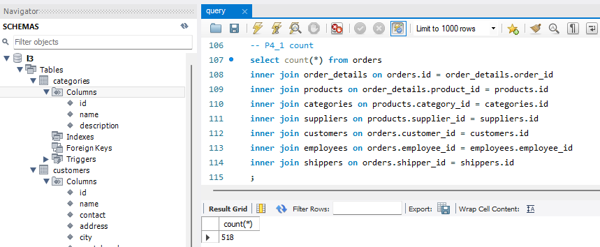

 - Змініть декілька операторів INNER на LEFT чи RIGHT. Визначте, що відбувається з кількістю рядків. Чому? Напишіть відповідь у текстовому файлі.

```sql
select count(*) from orders
inner join order_details on orders.id = order_details.order_id
left join products on order_details.product_id = products.id
right join customers on orders.customer_id = customers.id
left join categories on products.category_id = categories.id
left join suppliers on products.supplier_id = suppliers.id
left join employees on orders.employee_id = employees.employee_id
left join shippers on orders.shipper_id = shippers.id
;
```
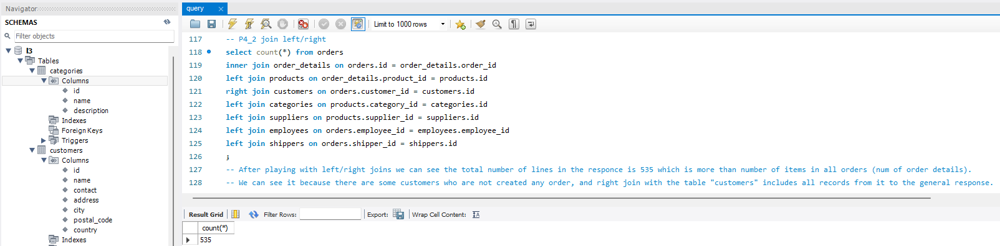

*Після перебору різних комбінацій LEFT/RIGHT JOIN ми отримали загальну кількість рядків 535, що є більшим за загальну кількість товарів в усіх замовленнях (кількість записів в таблиці `order_details`). Ми це отримали тому що в таблиці `customers` є такі клієнти, які не зробили жодного замовлення, відповідно, при RIGHT JOIN з цією таблицею система включила до відповіді всі її записи.*

 - Оберіть тільки ті рядки, де employee_id > 3 та ≤ 10.
```sql
select count(*) from orders
inner join order_details on orders.id = order_details.order_id
inner join products on order_details.product_id = products.id
inner join customers on orders.customer_id = customers.id
inner join categories on products.category_id = categories.id
inner join suppliers on products.supplier_id = suppliers.id
inner join employees on orders.employee_id = employees.employee_id
inner join shippers on orders.shipper_id = shippers.id
where employees.employee_id > 3 and employees.employee_id <= 10
;
```
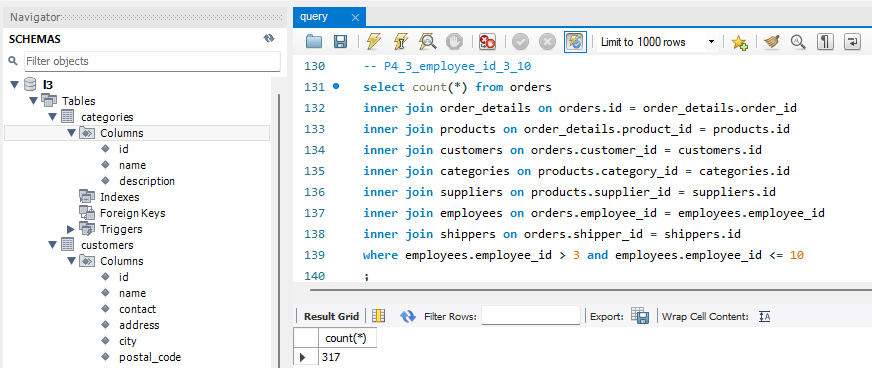

 - Згрупуйте за іменем категорії, порахуйте кількість рядків у групі, середню кількість товару (кількість товару знаходиться в order_details.quantity)

```sql
select  categories.name, count(*), avg(order_details.quantity) from orders
inner join order_details on orders.id = order_details.order_id
inner join products on order_details.product_id = products.id
inner join customers on orders.customer_id = customers.id
inner join categories on products.category_id = categories.id
inner join suppliers on products.supplier_id = suppliers.id
inner join employees on orders.employee_id = employees.employee_id
inner join shippers on orders.shipper_id = shippers.id
where employees.employee_id > 3 and employees.employee_id <= 10
group by categories.name
;
```
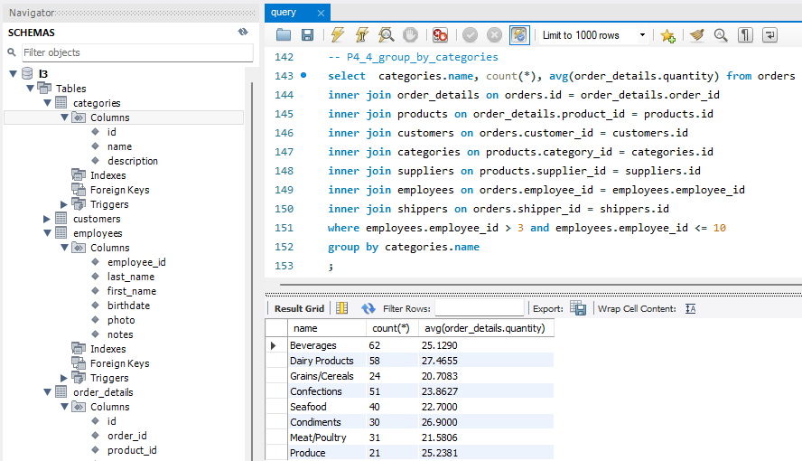

 - Відфільтруйте рядки, де середня кількість товару більша за 21.

```sql
select  categories.name, count(*), avg(order_details.quantity) as average_quantity from orders
inner join order_details on orders.id = order_details.order_id
inner join products on order_details.product_id = products.id
inner join customers on orders.customer_id = customers.id
inner join categories on products.category_id = categories.id
inner join suppliers on products.supplier_id = suppliers.id
inner join employees on orders.employee_id = employees.employee_id
inner join shippers on orders.shipper_id = shippers.id
where employees.employee_id > 3 and employees.employee_id <= 10
group by categories.name
having average_quantity > 21
;
```
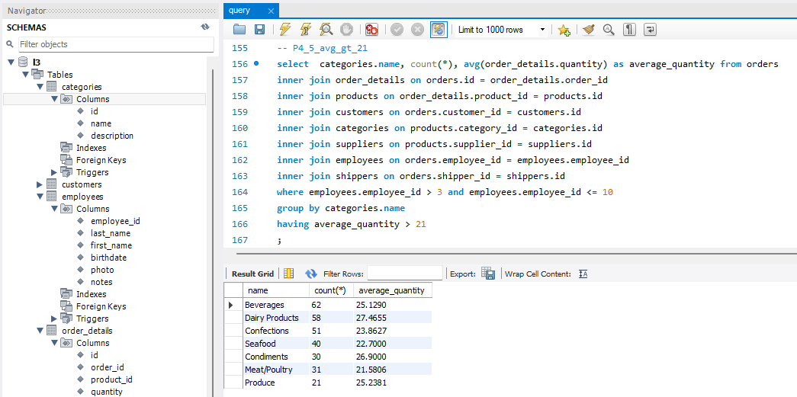

 - Відсортуйте рядки за спаданням кількості рядків.

```sql
select  categories.name, count(*) as line_cnt, avg(order_details.quantity) as average_quantity from orders
inner join order_details on orders.id = order_details.order_id
inner join products on order_details.product_id = products.id
inner join customers on orders.customer_id = customers.id
inner join categories on products.category_id = categories.id
inner join suppliers on products.supplier_id = suppliers.id
inner join employees on orders.employee_id = employees.employee_id
inner join shippers on orders.shipper_id = shippers.id
where employees.employee_id > 3 and employees.employee_id <= 10
group by categories.name
having average_quantity > 21
order by line_cnt desc
;
```
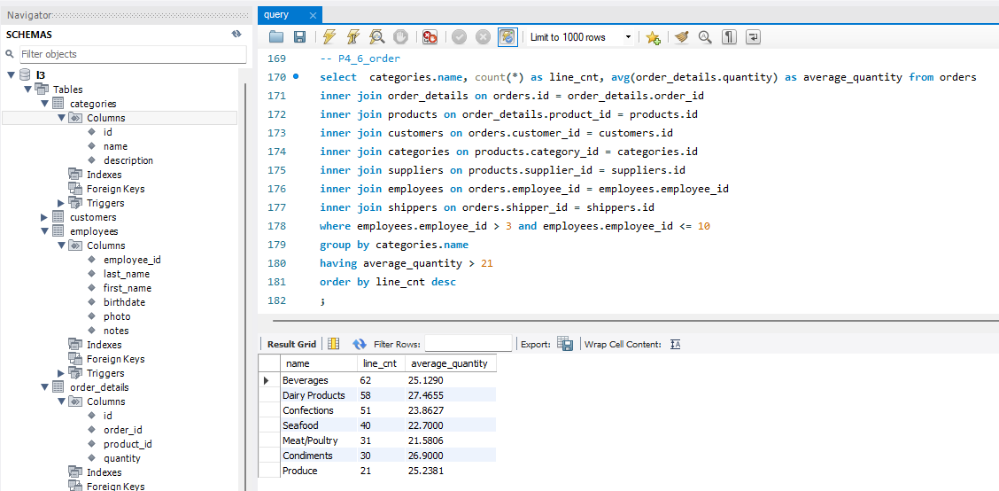

 - Виведіть на екран (оберіть) чотири рядки з пропущеним першим рядком.

```sql
select  categories.name, count(*) as line_cnt, avg(order_details.quantity) as average_quantity from orders
inner join order_details on orders.id = order_details.order_id
inner join products on order_details.product_id = products.id
inner join customers on orders.customer_id = customers.id
inner join categories on products.category_id = categories.id
inner join suppliers on products.supplier_id = suppliers.id
inner join employees on orders.employee_id = employees.employee_id
inner join shippers on orders.shipper_id = shippers.id
where employees.employee_id > 3 and employees.employee_id <= 10
group by categories.name
having average_quantity > 21
order by line_cnt desc
limit 4
offset 1
;
```
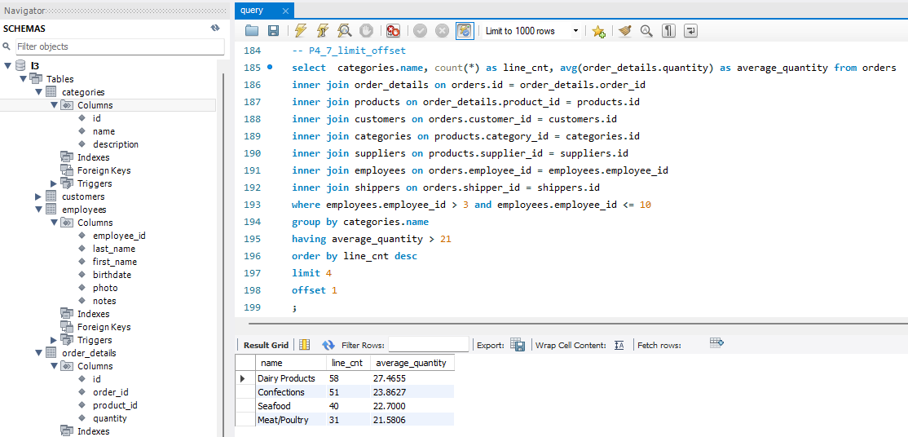
